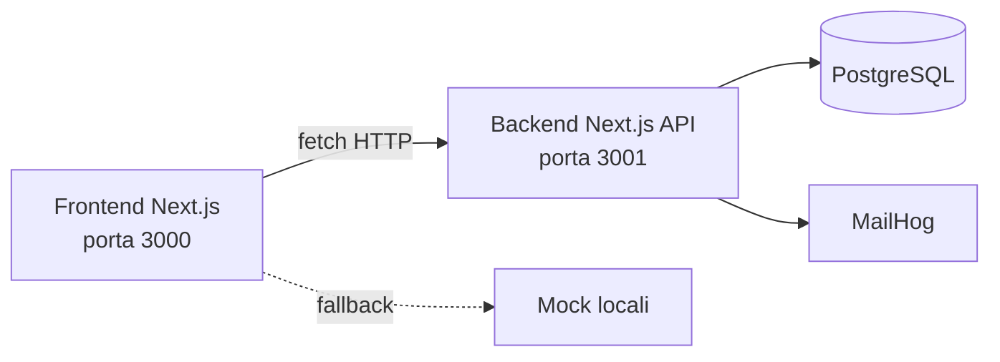
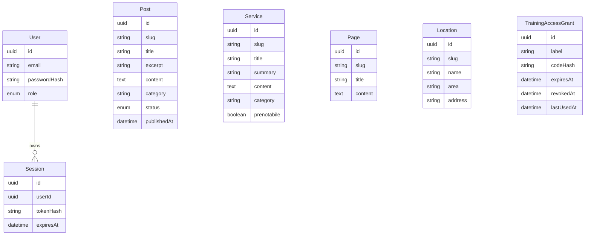

# Architettura

## Obiettivo del sistema

Il progetto realizza un portale per una pubblica assistenza locale con quattro macro-capacita:

- sito pubblico per cittadini, famiglie e volontari
- gestione editoriale di news ed eventi
- consultazione di servizi, sedi e pagine istituzionali
- accesso controllato a materiali formativi

## Scelta architetturale principale

Il repository e organizzato come due applicazioni Next.js separate:

- `frontend/` serve il sito pubblico e l'area admin
- `backend/` espone le API e gestisce persistenza, sessioni e regole applicative

Questa scelta evita di mischiare UI e logica dati nello stesso runtime e rende piu chiari:

- confine tra presentazione e dominio applicativo
- ownership del codice
- test e build separati
- deploy separabile in futuro

## Mappa delle responsabilita

### Frontend

Responsabile di:

- routing App Router pubblico e admin
- layout, navigazione e componenti UI
- fetch verso backend
- adattamento dati API -> modelli UI
- fallback su contenuti mock
- controllo accesso iniziale alle route admin via cookie

Cartelle chiave:

- `frontend/src/app/`
- `frontend/src/components/`
- `frontend/src/lib/api/`
- `frontend/src/content/`
- `frontend/src/middleware.ts`

### Backend

Responsabile di:

- endpoint API
- autenticazione e sessioni
- autorizzazione a ruoli
- validazione input
- accesso dati Prisma/PostgreSQL
- gestione grant per area formazione

Cartelle chiave:

- `backend/src/app/api/`
- `backend/src/lib/auth/`
- `backend/src/lib/validators/`
- `backend/src/lib/http/`
- `backend/prisma/`
- `backend/scripts/`

Nota:

- la root page del backend e solo un placeholder operativo; il comportamento rilevante e nelle route `/api/*`

### Infra

Responsabile di:

- database locale
- pgAdmin
- MailHog

La cartella `infra/docker/` non rappresenta ancora una strategia di deploy completa di applicazione.

## Vista logica del sistema

## Modello di dominio

Le entita principali definite in Prisma sono:

- `User`
- `Session`
- `Post`
- `Service`
- `Page`
- `Location`
- `TrainingAccessGrant`

## Routing frontend

### Pubblico

Route principali in `frontend/src/app/(public)`:

- `/`
- `/chi-siamo`
- `/servizi`
- `/prenota-servizi`
- `/sedi-contatti`
- `/protezione-civile`
- `/volontariato-formazione`
- `/donazioni`
- `/donatori-sangue`
- `/comunita`
- `/news-eventi`
- `/news-eventi/[slug]`
- `/area-riservata`
- `/privacy`
- `/cookie-policy`

Redirect legacy configurati in `frontend/next.config.ts`.

### Admin

Route principali in `frontend/src/app/(admin)`:

- `/admin/login`
- `/admin`
- `/admin/news`
- `/admin/news/new`
- `/admin/news/[id]/edit`

## Strategia dati: backend live con fallback mock

Il frontend ha fallback mock solo per una parte del sito pubblico:

- `posts`
- `services`
- `locations`

Non c'e fallback utile per:

- auth admin
- CRUD admin
- training access
- `pages`

Implicazione pratica:

- il sito pubblico puo sembrare sano anche con backend spento
- l'area admin e i materiali formazione dipendono sempre da backend reale

## Flussi principali

### 1. Rendering contenuti pubblici

1. Il frontend invoca gli adapter in `frontend/src/lib/api/*`.
2. Gli adapter chiamano il backend tramite `apiFetch`.
3. I dati vengono normalizzati per la UI.
4. Se la richiesta fallisce, `posts`, `services` e `locations` possono usare fallback mock.

### 2. Login admin

1. L'utente invia credenziali.
2. Il backend applica rate limit per IP e account.
3. La password viene verificata con `scrypt`.
4. Viene creata una sessione DB-backed.
5. Eventuali sessioni precedenti dello stesso utente vengono rimosse.
6. Il browser riceve il cookie `cv_session`.
7. Il middleware frontend consente l'accesso iniziale a `/admin/*`.

### 3. CRUD news

1. L'admin visualizza elenco news dal backend.
2. Il form admin crea o aggiorna un post.
3. Il backend valida con Zod e applica RBAC.
4. Prisma persiste il dato.

Regole principali:

- `ADMIN` e `EDITOR` possono leggere e modificare
- solo `ADMIN` puo cancellare

### 4. Accesso materiali formazione

1. Un operatore genera da CLI un grant con scadenza.
2. Il volontario inserisce il codice nella UI.
3. Il backend confronta l'hash del codice con il DB.
4. Se valido, emette il cookie `cv_training_access`.
5. I download sono consentiti solo con grant valido e non revocato.

## Sicurezza gia presente

- password hashate con `scrypt`
- session cookie `httpOnly`
- verifica ruoli lato backend
- rate limiting in memoria per login e gate formazione
- codice training memorizzato hashato
- cookie training firmato con HMAC
- CORS controllato rispetto a `FRONTEND_ORIGIN`

## Limiti attuali

- rate limit in memoria, quindi non distribuito
- il middleware frontend non garantisce autorizzazione reale: la enforcement resta lato backend
- nessun deploy di produzione descritto completamente nel repo
- materiali formazione attualmente rappresentati da contenuti demo in memoria
- nessun comando root unificato per avviare tutto il progetto

## Lettura consigliata

1. [../README.md](../README.md)
2. [ONBOARDING.md](ONBOARDING.md)
3. [SVILUPPO.md](SVILUPPO.md)
4. [API.md](API.md)
